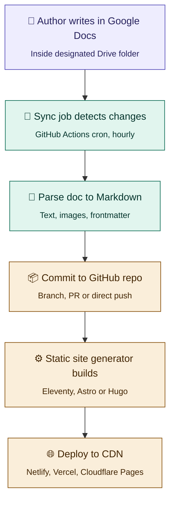

# Proposal: Modernizing the GeneXus Blog — Google Docs → GitHub → Static Site

## Quick clarification on MCP

MCP (Model Context Protocol) is a protocol designed for **AI assistants** to access external tools — it's not really an automation/workflow engine. If you want a *non-AI* system that polls Drive and commits to GitHub on a schedule or webhook, you'll want to use the Google Drive API directly, not MCP.

That said, there are two legitimate architectures here, and both are valid depending on your goals:

1. **Traditional automation** — a scheduled job (GitHub Actions cron, Cloudflare Worker, etc.) that calls the Drive API directly. Simple, deterministic, cheap.
2. **AI-powered pipeline** — a Claude/LLM agent that uses the Google Drive MCP server to read docs and intelligently normalize/edit/tag them before committing. More flexible, more expensive, less deterministic.

For iteration 1, I'd strongly recommend **option 1** (plain API) and keep MCP/AI as a future layer for things like auto-tagging, SEO suggestions, or translation.

## Pipeline diagram

*Three phases: **Authoring** (purple) → **Automation pipeline** (teal) → **Build & publish** (amber).*

---

## Architectural analysis

**The pattern you're describing is "Git-based CMS" or "Docs-as-source"** — it's well-established (sites like Stripe's Press, many dev blogs, and several open-source projects use variants of it). The core trade-off vs. WordPress:

**You gain:** security (no public admin surface, no DB), performance (pure static HTML on a CDN), version control (every post has git history), cost (near-zero hosting), and freedom from plugin upgrade treadmills.

**You lose:** real-time publishing (there's always a build delay), the rich WYSIWYG + preview workflow non-technical users expect, and the comments/membership features WordPress ships with.

For a corporate tech blog at GeneXus where authors are developers or devs-adjacent, this trade-off lands heavily in favor of the new approach.

### Layer-by-layer breakdown

#### Authoring layer (Google Docs)

Docs is great for collaborative writing but it's not a CMS — it has no concept of "post metadata" (slug, tags, publish date, author, draft status). You need a convention. The cleanest option is a small metadata table at the top of each doc, or a fenced block of YAML-style key/value pairs. Images pasted into the doc become Drive-hosted attachments that your parser must download and re-host in the repo (or on a CDN bucket).

#### Automation/sync layer

Three viable options, in order of simplicity:

1. **GitHub Actions scheduled workflow** — a cron job (e.g. hourly) runs a Node script that uses the Google Drive API to list docs in the folder, compares the latest revision ID (via `drive.revisions.list`) against a stored state file (`sync-state.json`), and processes what's new or changed. Dead simple, no servers, free. **This is what I'd ship in iteration 1.**
2. **Google Apps Script** attached to the Drive folder — triggers on edit, calls a webhook on your repo. Lower latency but more moving parts.
3. **Google Drive Push Notifications** (webhooks) hitting a Cloudflare Worker or Vercel Function — proper event-driven, but overkill for v1.

#### Parsing layer

This is the trickiest part. Google Docs has a structured JSON export via the Docs API (`documents.get`), which gives you a proper syntax tree. Do **not** rely on HTML export and parse it — you'll fight formatting quirks forever. The Docs API returns named styles (Heading 1/2/3), lists, tables, inline images with object IDs, and links. You walk the tree and emit Markdown.

#### Git/build layer

Straightforward: the sync job commits new `.md` files to `src/posts/`, pushes, and the push event triggers a CI build on your host of choice. **Net effect: doc edit → ~2-3 minutes → post live.**

---

## Static site generator comparison

Since you're open to alternatives, here's a fair comparison for **this specific use case** (content-heavy blog, Markdown source, JS-friendly team):

### Eleventy (11ty) — your current pick
- **Pros:** minimal, unopinionated, extremely fast for blogs, great Markdown handling out of the box, no JS runtime shipped to client by default. Templates in Nunjucks/Liquid/11ty.js. Great plugin ecosystem for images, RSS, syntax highlighting.
- **Cons:** you do assemble more yourself; less batteries-included than Astro.

### Astro — strong alternative worth a serious look
- **Pros:** component-based (you can use `.astro`, React, Vue, or Svelte components), built-in content collections with type-safe frontmatter, excellent MDX support (Markdown + components), built-in image optimization, image CDN integration, islands architecture (zero JS by default but you can opt-in where needed).
- **Cons:** heavier framework, newer (though mature at this point).

### Hugo — fastest builds by far
- **Pros:** single Go binary, builds huge sites in seconds, very mature.
- **Cons:** Go templates are unfamiliar for a JS team, and you lose the ability to use npm libraries in your build pipeline — a real cost if you want to do anything custom.

### Next.js (static export) — skip for a pure blog
Overkill, slower to build, and the React-first mental model isn't a win when your content is just Markdown.

### My recommendation

If you want simplicity and minimalism, stick with **Eleventy**. If you want more polish out of the box (image optimization, MDX for interactive examples — which matters for a dev blog at a tools company like GeneXus), go with **Astro**. Both are excellent; the choice is more about preferred ergonomics than capability.

---

## Iteration roadmap

### Iteration 1 — the walking skeleton
Keep it deliberately dumb. One folder in Drive, one Docs API call, rudimentary metadata (even just `Title: …` / `Slug: …` in the first lines), no image handling yet (ignore images or just link to Drive URLs temporarily), hourly cron, direct push to `main`, auto-deploy on push. **Goal: prove the loop works end-to-end with one post.**

### Iteration 2 — content modeling
Proper frontmatter convention, image extraction + re-hosting (commit to repo or push to a bucket like R2/S3), draft vs published states, categories/tags. Add a preview environment (deploy PRs to preview URLs).

### Iteration 3 — author experience
A small "Publish" Google Apps Script button that marks a doc as ready and triggers an immediate sync. Slack notifications on publish. Build status surfaced back into the Doc as a comment.

### Iteration 4 — richness
MDX/shortcodes for embedding live code examples (especially relevant for GeneXus), search (Pagefind is great — builds an index at build time, zero backend), RSS, related posts, view counts via a privacy-friendly analytics endpoint.

### Iteration 5 — AI layer (optional)
*Now* MCP or Claude API can genuinely shine: auto-generate meta descriptions, suggest tags, draft translations to Spanish/Portuguese (relevant for GeneXus's LATAM audience), review posts for accessibility issues or broken code snippets.

---

## Key points and recommendations

- The core architecture is **sound** and a significant upgrade from WordPress for a dev-audience blog.
- Keep iteration 1 **boring** — GitHub Actions cron + Drive API + custom parser + Eleventy or Astro + Netlify/Vercel.
- **Resist** the temptation to add MCP/AI before the basic loop is rock solid.
- The real risk is **underestimating the parser** — budget meaningful time for the Docs-to-Markdown converter and image handling. That's where every project of this kind bleeds time.
- Use a **metadata convention** in the doc from day one (even a trivial one) because retrofitting content modeling later is painful.
- **Deploy previews per branch** are worth setting up early — authors need to see how their post will look before it's live. That substitutes for the preview pane they're used to in WordPress.

---

## Suggested libraries and resources

### Sync layer
- [`googleapis`](https://www.npmjs.com/package/googleapis) — official Node.js Google API client
- Lighter alternatives: `@googleapis/drive` and `@googleapis/docs`
- Auth: service account with JSON key stored in GitHub Secrets

### Google Docs → Markdown conversion
No single perfect library exists, but good starting points:
- Community `docs-markdown`-style tools on GitHub
- Google Docs add-on "Docs to Markdown" by Ed Bacher (useful as a reference implementation)
- Realistically, you'll write a **custom walker** over the Docs API structured content — it's ~200-400 lines of TypeScript and gives you full control

### Image handling
- [`sharp`](https://sharp.pixelplumbing.com/) for processing
- Commit optimized versions to the repo under `/assets/posts/<slug>/`
- Or push to Cloudflare R2 / AWS S3 and rewrite URLs in the Markdown

### Eleventy plugins
- `@11ty/eleventy-img` — image optimization at build
- `@11ty/eleventy-plugin-syntaxhighlight`
- `@11ty/eleventy-plugin-rss`
- `@11ty/eleventy-plugin-directory-output`
- `@photogabble/eleventy-plugin-interlinker` — wiki-style cross-links between posts

### Astro equivalents
- **Content Collections** (built-in) with Zod schemas for frontmatter validation
- `@astrojs/mdx`
- `astro:assets` for images
- `astro-pagefind` for search

### Deployment
- **Cloudflare Pages** or **Netlify** — both have excellent free tiers
- Cloudflare has a slight edge on performance and generous bandwidth for a corporate blog

### Search
- **[Pagefind](https://pagefind.app)** — builds a static search index at compile time, no backend, genuinely good

### Analytics (when it matters)
- **Plausible** or **Umami** — privacy-respecting, no cookie banner needed

### Reference implementations to study
- [Stripe Press](https://press.stripe.com)
- [Linear's changelog](https://linear.app/changelog)
- [Netlify's blog](https://www.netlify.com/blog/)

All three are git-backed static sites with editorial workflows that could teach you a lot.

---

## Next step

If you want, in a follow-up iteration I can sketch the repo structure for iteration 1 — `package.json`, folder layout, the GitHub Actions workflow YAML, and a stub of the Docs-to-Markdown parser in TypeScript — so you have something concrete to present to the team.
